# Access Derivation and Auditability

## Purpose

This document describes how **access control and auditability** are achieved in this project
*without centralising content, duplicating artefacts, or weakening confidentiality*.

It explains how declared artefact metadata can be used to **derive access rights operationally**
and to support audits that are rigorous, proportionate, and respectful of contractual and security constraints.

This document is conceptual by design. It defines principles and responsibilities, not implementation details.

---

## Core principle

Access to artefacts is **not granted ad hoc** and **not negotiated informally**.

It is **derived** from information that is already declared and enforced elsewhere in the system.

Specifically:

> **Access is derived from artefact metadata, not decided manually.**

This principle applies uniformly across repositories, registries, and hosted services.

---

## Declared intent as the source of truth

Every artefact in the system declares:

- its visibility
- its intended audience
- its form
- its role in the traceability chain
- its institutional owner

These declarations express **intent**, not permissions.

They answer questions such as:

- Who should be able to access this artefact?
- Under what constraints?
- For what purpose?
- Under whose responsibility?

The system treats these declarations as the **authoritative source of access intent**.

The structure and semantics of these declarations are defined in [`artefact-classification.md`](artefact-classification.md), which serves as the normative reference for how artefact metadata is expressed, validated, and enforced throughout the project.

---

## Derived access, not centralised content

This project does **not** propose:

- centralising confidential content
- duplicating artefacts in a separate system
- replacing repository-level access controls
- introducing a new authority that overrides existing tools

Instead, it introduces a narrow, well-defined concept:

> A derived view of access intent, continuously maintained from artefact metadata.

This derived view may be materialised as an administrative registry or database whose **sole responsibility** is:

> **To answer the question: who may access which artefact, and why?**

It does not store content. 
It does not grant access by itself.  
It does not interpret policy.

It reflects declared constraints.

---

## Conceptual workflow (no over-engineering)

At a conceptual level, the workflow is simple:

1. Artefacts declare metadata as part of normal project work  
2. Automation scans and validates this metadata continuously  
3. A derived visibility and ownership map is produced  
4. This map is made available to authorised administrative processes  
5. Access rights are granted, reviewed, or revoked based on this map  

```mermaid
flowchart LR
    A@{ shape: docs, label: "📄 Artefacts<br/>with declared metadata" }
    B@{ shape: cyl, label: "🗄️ Derived visibility<br/>and ownership map" }
    C@{ shape: stadium, label: "🔐Access granted,<br/>reviewed, or revoked" }

    A --> |"⚙️ Automated validation<br/>and scanning<br/> by CI/CD pipelines"| B
    B --> |"⚡️ Authorised<br/>administrative processes"|C
```

Nothing in this flow requires new artefacts, new documents, or new decisions.

It is **derived state**, not a new source of truth.

---

## Auditability without default disclosure

Audits require confidence, not omniscience.

An auditor must be able to verify that:

- artefacts exist
- artefacts are correctly classified
- constraints are applied consistently
- responsibilities are clearly assigned
- changes are traceable and reviewed

This can be achieved by inspecting:

- metadata
- structure
- traceability links
- CI/CD reports
- derived visibility maps

**without automatically accessing confidential content**.

Content access remains possible when required by audit scope,
but it becomes an **explicit, scoped decision**, not a structural prerequisite.

---

## Time-bound and purpose-bound access

Derived access enables access to be:

- role-bound
- scope-limited
- auditable
- time-bound
- revocable

This is particularly important for:

- external auditors
- temporary review teams
- incident investigations
- regulatory inspections

Access becomes an operational act with a clear rationale, not an accumulation of permanent permissions.

---

## Relationship to existing tools

This approach is deliberately **tool-agnostic**.

It can be applied whether artefacts live in:

- GitHub
- GitLab
- multiple repositories
- artefact registries
- hosted services

Existing access control mechanisms remain authoritative. Derived access information informs how they are used, not whether they exist.

---

## Institutional benefits

This model:

- reduces manual access negotiation
- shortens audit preparation cycles
- improves confidence in governance
- preserves vendor and platform confidentiality
- avoids blanket permissions
- makes exceptions visible and accountable

Most importantly, it replaces informal knowledge with **explicit, inspectable structure**.

---

## Final note

In institutional systems, trust is not established by exposure, but by clarity of structure and discipline of process.

By deriving access from declared intent, this project demonstrates how transparency and confidentiality can coexist without friction.

Auditability, in this model, is not an afterthought. It is a property of the system itself.

