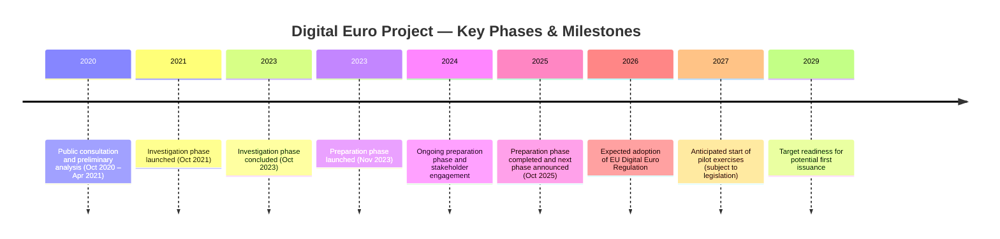

# Digital Euro Project Timeline

This document provides a high-level, factual timeline of the Digital Euro project based on publicly available information published by the European Central Bank (ECB) and related EU institutions.

The timeline is intended to establish **shared temporal context**, not to serve as a detailed project plan or commitment schedule.

---

## Timeline (high-level milestones)

## Narrative overview

### 2020–2021: Public consultation and initial analysis

The European Central Bank (ECB) conducted a broad public consultation and internal analysis to assess the potential role of a digital euro. This phase explored user needs, policy objectives, and high-level design considerations, and included extensive engagement with citizens, market participants, and public institutions.

**References:**
- ECB – *Report on a digital euro* (October 2020):  
  https://www.ecb.europa.eu/pub/pdf/other/Report_on_a_digital_euro~4d7268b458.en.pdf
- ECB – *Public consultation on a digital euro* (2020–2021):  
  https://www.ecb.europa.eu/euro/digital_euro/consultation/html/index.en.html

---

### 2021–2023: Investigation phase

In October 2021, the ECB formally launched the investigation phase of the Digital Euro project. Over two years, this phase examined:

- design options  
- distribution models  
- privacy and data protection considerations  
- implications for monetary policy and financial stability  

The investigation phase concluded in October 2023.

**References:**
- ECB press release – *ECB launches digital euro investigation phase* (14 July 2021):  
  https://www.ecb.europa.eu/press/pr/date/2021/html/ecb.pr210714~d99198ea23.en.html
- ECB – *Progress on the digital euro* (Investigation phase updates):  
  https://www.ecb.europa.eu/euro/digital_euro/progress/html/index.en.html

---

### 2023–2025: Preparation phase

Following the investigation phase, the ECB launched a two-year preparation phase in November 2023. This phase focuses on:

- drafting and refining the digital euro scheme rulebook  
- selecting potential service providers through procurement processes  
- advancing technical design and experimentation  
- deepening engagement with stakeholders, including payment service providers (PSPs) and merchants  

The preparation phase is scheduled to conclude in October 2025.

**References:**
- ECB press release – *ECB launches preparation phase of digital euro project* (18 October 2023):  
  https://www.ecb.europa.eu/press/pr/date/2023/html/ecb.pr231018~1b9b3b86c8.en.html
- ECB – *Digital euro rulebook development*:  
  https://www.ecb.europa.eu/euro/digital_euro/timeline/rulebook/html/index.en.html

---

### 2026: Legislative decision

Progress beyond the preparation phase is dependent on the adoption of a European Union Regulation establishing the legal basis for the digital euro. Adoption is subject to the EU legislative process involving the European Commission, the European Parliament, and the Council of the European Union.

**References:**
- European Commission – *Proposal for a Regulation on the digital euro* (COM/2023/369):  
  https://eur-lex.europa.eu/legal-content/EN/TXT/?uri=COM:2023:369:FIN
- ECB blog – *Why a digital euro needs a sound legal basis*:  
  https://www.ecb.europa.eu/press/blog/date/2023/html/ecb.blog231128~e07c92d2a0.en.html

---

### 2027–2029: Piloting and potential issuance

Subject to legislative approval and technical readiness:

- pilot exercises could begin around 2027  
- further testing and system integration would follow  
- the Eurosystem aims to be ready for a potential first issuance around 2029  

These dates are indicative and depend on institutional, technical, and political factors.

**References:**
- ECB – *Digital euro: progress and next steps*:  
  https://www.ecb.europa.eu/euro/digital_euro/progress/html/index.en.html
- ECB – *Frequently asked questions on a digital euro*:  
  https://www.ecb.europa.eu/euro/digital_euro/faqs/html/index.en.html

---

## How to use this timeline

This timeline is deliberately **coarse-grained**.

It should be used to:

- provide shared orientation across stakeholders  
- contextualise specifications and implementation work  
- align expectations regarding dependencies and sequencing  

It should not be used as:

- a delivery commitment  
- a contractual schedule  
- a substitute for detailed project planning  

In this repository, more detailed artefacts (for example specifications, tests, and CI/CD pipelines) are expected to evolve *within* these phases and to reference them where appropriate.

---

## Sources and transparency note

All milestones in this timeline are derived exclusively from publicly available ECB communications and EU legislative materials.

No confidential, restricted, or non-public information is used.

As the Digital Euro project evolves, this timeline should be updated to reflect officially published changes.

