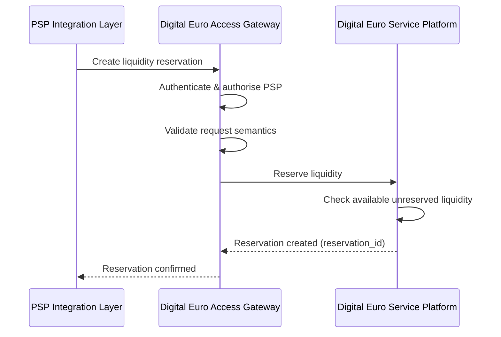
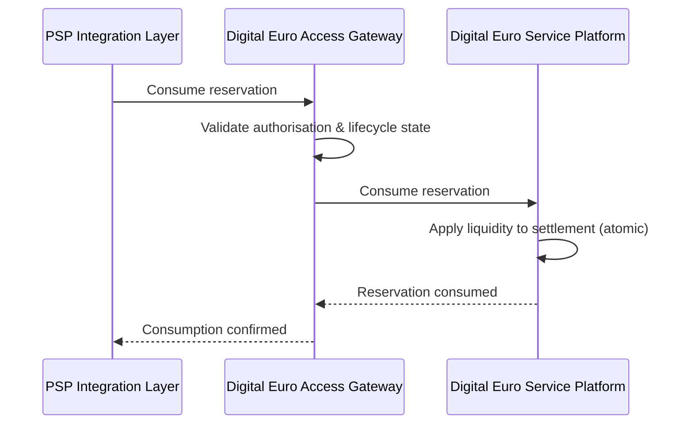
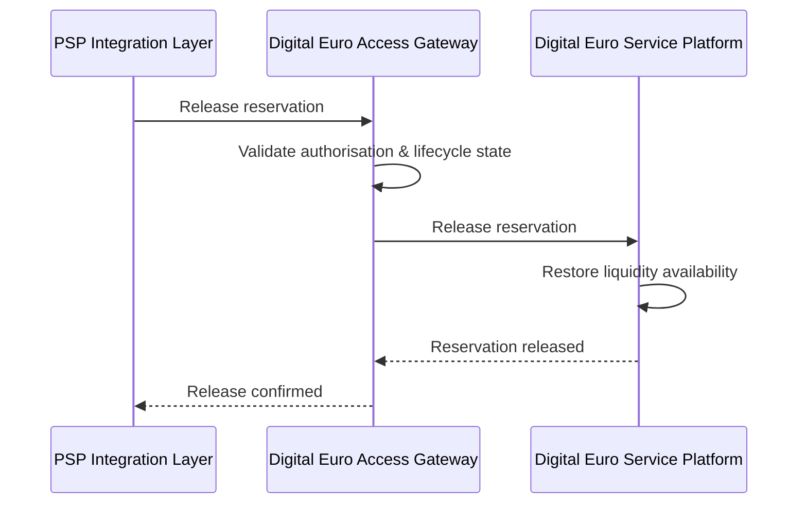
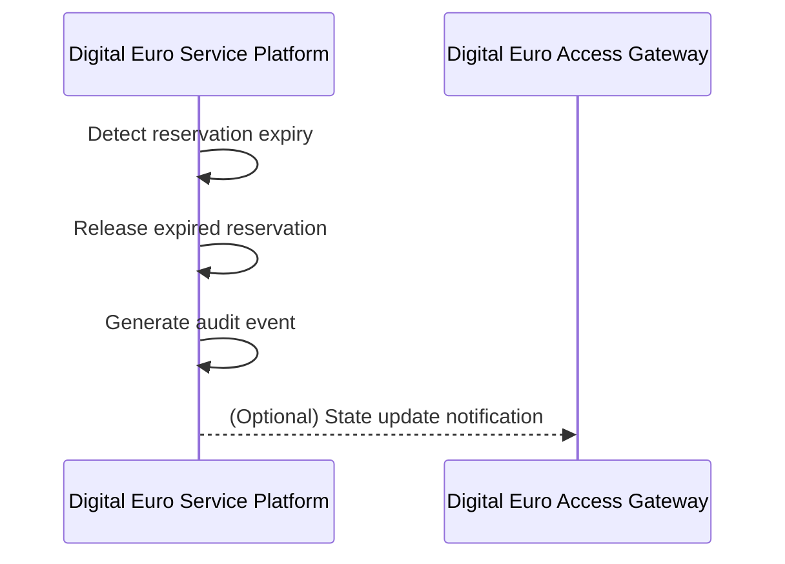

# Liquidity Reservation — Interface Behaviour Specification

## Purpose

This document defines the **interaction behaviour between system components**
required to realise liquidity reservation within the Digital Euro system.

It specifies **how components interact** to fulfil the functional requirements
defined in the Liquidity Reservation — Functional Specification.

This document does not define API syntax or data schemas.

---

## Normative references

This specification is constrained by:

- Liquidity Reservation — Functional Specification  
- System Architecture — Component Inventory  

All interactions described here MUST comply with the functional requirements
and architectural boundaries defined upstream.

---

## Architectural components in scope

This specification applies to interactions between:

- **PSP Integration Layer** (illustrative, non-standardised)
- **COMP-EUR-05 — Digital Euro Access Gateway**
- **COMP-EUR-04 — Digital Euro Service Platform (DESP)**

---

## Interaction principles

### INT-LR-01 — Canonical platform access

All interactions that affect authoritative liquidity state
MUST occur via the **Digital Euro Access Gateway**.

Direct access to DESP services MUST NOT be exposed.

---

### INT-LR-02 — Authoritative state ownership

Authoritative liquidity and reservation state
MUST be maintained exclusively within DESP.

PSP-side systems MUST NOT persist or derive authoritative liquidity state.

---

### INT-LR-03 — Explicit orchestration

Liquidity reservations MUST be created, consumed, released,
or expired through explicit operations.

Implicit state changes are prohibited.

---

### INT-LR-04 — Idempotent invocation

All liquidity reservation operations MUST support idempotent invocation.

- PSP Integration Layers handle client-facing retries and idempotency keys.
- Replayed requests MUST NOT result in duplicate side effects.
- Conflicting reuse of identifiers MUST be rejected.

---

## Interface responsibilities

### PSP Integration Layer

The PSP Integration Layer MUST:

- initiate reservation-related requests on behalf of PSP operations,
- perform syntactic validation of requests,
- manage retries and idempotency,
- invoke the Digital Euro Access Gateway for authoritative operations.

It MUST NOT:

- alter authoritative liquidity state,
- bypass the Access Gateway.

---

### Digital Euro Access Gateway (`COMP-EUR-05`)

The Access Gateway MUST:

- authenticate and authorise PSP system identities,
- validate request semantics and lifecycle preconditions,
- route authorised requests to DESP services,
- enforce platform-level controls (rate limiting, logging, observability).

It MUST NOT:

- implement PSP-specific business logic,
- store or process end-user personal data.

---

### Digital Euro Service Platform (`COMP-EUR-04`)

DESP services MUST:

- create and persist authoritative reservation records,
- enforce lifecycle integrity and exclusivity constraints,
- perform atomic reservation, consumption, and release operations,
- generate audit-relevant events for all state changes.

DESP services MUST NOT:

- accept direct calls from PSPs,
- rely on PSP-side state for reservation integrity.

---

## Interaction flows

### Flow 1 — Create reservation

**Trigger:** PSP requires liquidity to be reserved for a pending settlement.

1. PSP Integration Layer submits a reservation request.
2. Access Gateway authenticates and authorises the PSP.
3. Access Gateway validates request semantics.
4. Access Gateway routes the request to DESP.
5. DESP verifies available unreserved liquidity.
6. DESP creates a reservation record.
7. Reservation identifier is returned to the PSP.

**Constraints:**
- Operation MUST be idempotent.
- Creation MUST fail if insufficient liquidity is available.

### Flow 2 — Consume reservation

**Trigger:** Settlement execution requires consumption of reserved liquidity.

1. PSP Integration Layer submits a consumption request.
2. Access Gateway validates lifecycle preconditions.
3. Access Gateway routes the request to DESP.
4. DESP consumes the reservation atomically.
5. Liquidity is applied to settlement.
6. Confirmation is returned to the PSP.

**Constraints:**
- Consumption MUST be irreversible.
- Only active reservations MAY be consumed.

### Flow 3 — Release reservation

**Trigger:** Settlement does not occur.

1. PSP Integration Layer submits a release request.
2. Access Gateway validates authorisation and state.
3. Access Gateway routes the request to DESP.
4. DESP releases the reservation.
5. Liquidity becomes immediately available again.

**Constraints:**
- Release MUST NOT be allowed after consumption.
- Operation MUST be idempotent.

### Flow 4 — Reservation expiry

**Trigger:** Reservation exceeds its validity period.

1. DESP detects reservation expiry.
2. DESP releases the reservation automatically.
3. An audit event is generated.

**Constraints:**
- Expiry MUST NOT require external invocation.
- Expired reservations MUST NOT be consumable.

## Error handling

### INT-LR-E01 — Insufficient liquidity

Reservation creation MUST fail
if available unreserved liquidity is insufficient.

---

### INT-LR-E02 — Invalid lifecycle transition

Operations inconsistent with the reservation lifecycle
MUST be rejected.

---

### INT-LR-E03 — Authorisation failure

Unauthorised reservation operations
MUST be rejected without side effects.

---

## Relationship to downstream artefacts

This interface behaviour specification constrains:

- API definitions (e.g. OpenAPI),
- settlement orchestration logic,
- automated tests,
- CI/CD validation rules.

Downstream artefacts MUST NOT contradict
the interaction patterns defined herein.

---

## Disclaimer

This specification is **illustrative**.

It demonstrates one possible interaction model for liquidity reservation within a digital currency platform, without asserting an official ECB or Eurosystem implementation.

