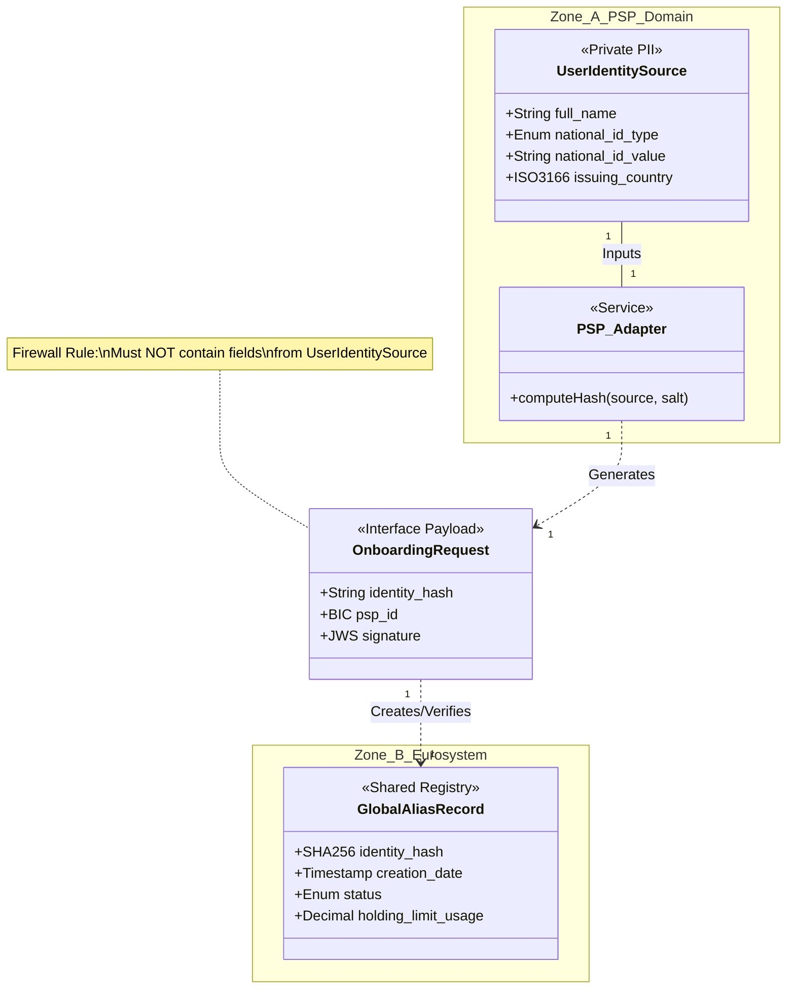

# User Onboarding — Data Model Specification

## 1. Identification
- **Global ID:** `SPEC-OB-DATA`
- **Part of Set:** `SPEC-SET-ONB`
- **Traceability:**
    - **Upstream Spec:** `SPEC-OB-FUNC` (Implements `REQ-OB-FUNC-01` and `02`)
    - **Upstream Arch:** `@arch=SET-ARCH:0.1.0` (Implements Data Schemas for `COMP-EUR-02` and `COMP-EUR-04`)

## 2. Purpose and Scope

This document defines the **Logical Data Model** for User Onboarding.

It strictly classifies data entities based on the **Security & Privacy Zones** to ensure that Personally Identifiable Information (PII) never crosses into the Eurosystem Domain (Zone B).

## 3. The Privacy Strategy (Narrative)

### 3.1 The "Privacy Firewall" Concept
In accordance with **`security-and-privacy-zones.md`**, the Digital Euro architecture enforces a strict separation of data knowledge:

1.  **Zone A (PSP Domain):** The PSP *must* know the user's real identity to perform KYC/AML checks mandated by law (`Rule ONB-02`).
2.  **Zone B (Eurosystem Domain):** The Central Infrastructure *must* enforce the "One Person, One Identity" rule (`Rule ONB-01`) to prevent holding limit breaches.

**The Conflict:** The Eurosystem needs to verify uniqueness (requiring identity) but is legally forbidden from processing PII (requiring anonymity).

### 3.2 The Data Solution
To resolve this, this specification splits the User Identity into two disjoint entities:
- **`UserIdentitySource` (Private):** The clear-text data. This never leaves the PSP's internal system.
- **`GlobalAliasRecord` (Shared):** A cryptographic derivative (`SHA-256`) that acts as a unique pointer without revealing the source.

**Visualisation (Normative)**

## 4. General Principles

| ID | Principle | Requirement Statement | Trace |
| :--- | :--- | :--- | :--- |
| **DM-OB-01** | **Data Minimisation** | The Central Infrastructure (`COMP-EUR-02` via `04`) MUST store only the cryptographic hash of the user identity, never the clear-text source data. | `Rule ONB-01` |
| **DM-OB-02** | **Deterministic Derivation** | The `identity_hash` MUST be reproducible by any PSP given the same National ID and Scheme Salt. | `REQ-OB-FUNC-03` |
| **DM-OB-03** | **Zone Containment** | Entities classified as **Zone A** MUST NOT appear in API payloads sent to the Access Gateway (`SYS-GWY`). | `ARCH-SEC-01` |

## 5. Data Dictionary

### 5.1 Entity: UserIdentitySource (Private PII)
**Classification:** `ZONE A ONLY` (PSP Internal)
**Description:** The source documents collected during KYC. Used solely to compute the hash.

**Parsing Context:** `Scope: ZoneA_Storage`

| ID | Attribute | Type | Description / Constraint | Trace |
| :--- | :--- | :--- | :--- | :--- |
| **DAT-SRC-01** | `national_id_type` | `Enum` | The type of document used. Values: `PASSPORT`, `ID_CARD`, `TAX_ID`. | `Rule ONB-02` |
| **DAT-SRC-02** | `national_id_value` | `String` | The unique number on the document. Format: Normalised (Upper case, no spaces). | `REQ-OB-FUNC-02` |
| **DAT-SRC-03** | `issuing_country` | `ISO-3166` | The country code of the issuer (e.g., `DE`, `FR`). | `ISO-3166-1` |
| **DAT-SRC-04** | `full_name` | `String` | Legal name (for internal PSP KYC logs only). | `AMLD5` |

### 5.2 Entity: GlobalAliasRecord (The Registry)
**Classification:** `ZONE B` (Eurosystem Shared)
**Owner:** Alias Service (`COMP-EUR-02`)
**Description:** The authoritative record stored in the Registry, queried by the DESP Platform.

**Parsing Context:** `Scope: ZoneB_Registry`

| ID | Attribute | Type | Description / Constraint | Trace |
| :--- | :--- | :--- | :--- | :--- |
| **DAT-ALS-01** | `identity_hash` | `SHA-256` | **Primary Key.** The anonymised unique identifier. Derived from `SHA256(Salt + ID_Type + ID_Value)`. | `Rule ONB-01` |
| **DAT-ALS-02** | `creation_date` | `Timestamp` | UTC timestamp of first registration. | `AUD-OB-01` |
| **DAT-ALS-03** | `status` | `Enum` | Lifecycle state. Values: `ACTIVE`, `SUSPENDED`. | `ONB-FUNC-States` |
| **DAT-ALS-04** | `holding_limit_usage`| `Decimal` | The current aggregate holdings across all PSPs. (Technical field for Limit Enforcement by `COMP-EUR-04`). | `Rule LIQ-04` |
| **DAT-ALS-05** | `active_psp_id` | `BIC` | The BIC of the PSP currently holding the account. Required for **Switching** (`Rule AM-011-004`). | `Rule ONB-04` |

### 5.3 Entity: OnboardingRequest (The Payload)
**Classification:** `INTERFACE` (Zone A $\to$ Zone B)
**Consumer:** Access Gateway (`COMP-EUR-05`) & DESP Platform (`COMP-EUR-04`)
**Description:** The data structure transmitted over the wire during `OP-OB-01` (Register) or `OP-OB-03` (Switch).

**Parsing Context:** `Scope: API_Payload`

| ID | Attribute | Type | Card. | Description / Constraint | Trace |
| :--- | :--- | :--- | :---: | :--- | :--- |
| **DAT-MSG-01** | `identity_hash` | `String` | 1..1 | Hex-encoded SHA-256 hash. Regex: `^[a-f0-9]{64}$` | `INT-OB-01` |
| **DAT-MSG-02** | `psp_id` | `BIC` | 1..1 | The BIC of the requesting PSP (becomes `active_psp_id`). | `DAT-PAR-002` |
| **DAT-MSG-03** | `signature` | `JWS` | 1..1 | Cryptographic signature of the payload. | `INT-OB-02` |
| **DAT-MSG-04** | `idempotency_key` | `UUID` | 1..1 | Unique request ID for retry safety. | `INT-OB-04` |
| **DAT-MSG-05** | `switch_consent` | `Boolean` | 0..1 | **Optional.** Set to `true` if this is a Switching Request. Overrides `DUPLICATE_IDENTITY` check. | `Rule ONB-04` |

## 6. Mapping Rules (Transformation Logic)

This section defines how to transform **Source** (Zone A) into **Alias** (Zone B).

### 6.1 The Hashing Algorithm
To ensure `REQ-OB-FUNC-01` (Determinism), all PSPs MUST implement the following logic:

1.  **Normalisation:**
    - `Input = UpperCase(Trim(national_id_value))`
    - `Type = UpperCase(national_id_type)`
    - `Country = UpperCase(issuing_country)`
2.  **Concatenation:**
    - `RawString = Country + ":" + Type + ":" + Input`
    - *Example:* `DE:PASSPORT:123456789`
3.  **Salting:**
    - `SaltedString = SCHEME_IDENTITY_SALT + RawString`
4.  **Hashing:**
    - `IdentityHash = SHA256(SaltedString)`

---

## Appendix: How to Parse This Specification

**For Automation Engineers:**

1.  **Schema Validation (OpenAPI):**
    - Use **Section 5.3 (OnboardingRequest)** to generate or validate the `components/schemas` in your OpenAPI definition.
    - *Constraint Check:* Ensure the `identity_hash` field in OpenAPI has the `pattern: ^[a-f0-9]{64}$` derived from `DAT-MSG-01`.

2.  **Privacy Audit Script:**
    - Write a linter that scans the `50-code` layer.
    - **Rule:** If a variable name matches attributes from **Section 5.1 (Zone A)** (e.g., `national_id_value`), it **MUST NOT** appear in any log file or outbound HTTP request to `SYS-GWY`.

3.  **Test Data Generation:**
    - Use the Algorithm in **Section 6.1** to generate consistent test vectors.
    - *Example:* Create a "Golden Dataset" of {Input, Expected Hash} to verify that different PSP implementations produce identical hashes.

