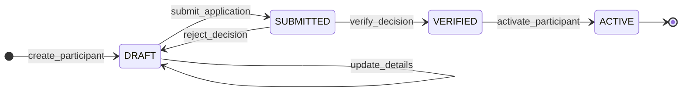

# Participant Onboarding — Functional Specification

## Purpose

This document defines the **functional behaviour** of the participant onboarding process.
It specifies the **State Machine** (valid transitions) and the **Business Rules** that guard those transitions.

## 1. General Principles

Global invariants that apply to the entire lifecycle.

| ID | Principle | Requirement Statement | Trace |
| :--- | :--- | :--- | :--- |
| **ONB-GEN-01** | **Single Identity** | Each legal entity (identified by BIC) MUST have exactly **one** participant record in the system. Duplicate BICs are forbidden. | `RULE-ONB-01` |
| **ONB-GEN-02** | **State Integrity** | A participant record MUST always be in exactly one valid lifecycle state. "Floating" or null states are forbidden. | `ARCH-DESP` |
| **ONB-GEN-03** | **Idempotency** | Repeated submission of identical commands (same Idempotency Key) MUST return the same result without side effects. | `INT-GEN-01` |

## 2. Lifecycle States

The valid states for a participant record (`DAT-PAR-005`).

| State ID | State Name | Description | Authority |
| :--- | :--- | :--- | :--- |
| **ST-01** | `DRAFT` | Record created but not yet processing. Data is mutable. | PSP (Self) |
| **ST-02** | `SUBMITTED` | Locked for validation. Awaiting Eurosystem verification. | System |
| **ST-03** | `VERIFIED` | Validation passed. Ready for activation. | Eurosystem |
| **ST-04** | `ACTIVE` | Fully operational. Keys are live. | System |

## 3. State Transitions (The State Machine)

This table defines the **only** permitted transitions. Any transition not listed here is implicitly **FORBIDDEN**.

**Parsing Context:** `Scope: StateMachine`

| ID | From State | To State | Trigger / Event | Guard Condition (Rule Ref) | Trace |
| :--- | :--- | :--- | :--- | :--- | :--- |
| **TR-01** | `(null)` | `DRAFT` | `create_participant` | `ONB-VAL-01` (Valid BIC) | `INT-FLOW-01` |
| **TR-02** | `DRAFT` | `DRAFT` | `update_details` | `ONB-GEN-01` (Uniqueness) | `INT-FLOW-02` |
| **TR-03** | `DRAFT` | `SUBMITTED` | `submit_application` | `ONB-VAL-02` (Mandatory Fields) | `INT-FLOW-03` |
| **TR-04** | `SUBMITTED` | `VERIFIED` | `verify_decision` | `ONB-SEC-01` (Admin Only) | `RULE-GOV-03` |
| **TR-05** | `SUBMITTED` | `DRAFT` | `reject_decision` | `ONB-SEC-01` (Admin Only) | `RULE-GOV-03` |
| **TR-06** | `VERIFIED` | `ACTIVE` | `activate_participant` | `ONB-SEC-02` (Tech Check) | `RULE-OPS-01` |

## 4. Functional Business Rules

Specific logic required to execute the transitions above.

### 4.1 Validation Rules (Guards)

| ID | Rule Name | Logic / Constraint | Trace |
| :--- | :--- | :--- | :--- |
| **ONB-VAL-01** | **BIC Format** | Input `bic` MUST match ISO 9362 regex. | `ISO-9362` |
| **ONB-VAL-02** | **Completeness** | Transition to `SUBMITTED` requires: `legal_name`, `role`, `contact_email`, `jwks_url`. | `DM-PAR-03` |
| **ONB-VAL-03** | **Key Accessibility** | Transition to `ACTIVE` requires the system to successfully fetch and validate the PSP's public keys from `jwks_url`. | `ARCH-SEC-04` |

### 4.2 Security & Audit Rules

| ID | Rule Name | Logic / Constraint | Trace |
| :--- | :--- | :--- | :--- |
| **ONB-SEC-01** | **Role Separation** | `verify_decision` MUST be performed by a user with role `EUROSYSTEM_OPERATOR`. PSPs cannot verify themselves. | `RULE-GOV-02` |
| **ONB-AUD-01** | **Transition Log** | Every row in the Transition Table MUST trigger an insert into `OnboardingAuditLog` (`DAT-LOG`). | `ARCH-AUDIT` |
| **ONB-AUD-02** | **Evidence Linking** | When moving to `VERIFIED`, the system MUST record the `evidence_hash` of the documents checked. | `DM-LOG-05` |

---

## Appendix: How to Parse This Specification

**For Automation Engineers:**

1.  **State Machine Generation:**
    * Parse **Section 3 (State Transitions)**.
    * Generate a Directed Acyclic Graph (DAG) or a Switch-Case block for your code.
    * *Validation:* Ensure your code throws `InvalidTransitionError` for any pair not in this table.

2.  **Test Case Generation:**
    * For every row in **Section 3**, generate a Positive Test (should succeed).
    * For every Guard Condition in **Section 4**, generate a Negative Test (should fail if condition met).

3.  **Traceability:**
    * `Trace` columns may refer to:
        * `RULE-*` (Rulebook)
        * `ARCH-*` (Architecture)
        * `DM-*` (Data Model Spec)
        * `INT-*` (Interface Spec)