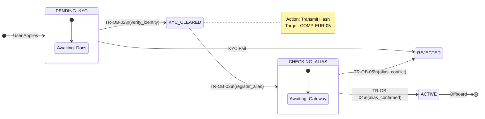

# User Onboarding — Functional Specification

## 1. Identification
- **Global ID:** `SPEC-OB-FUNC`
- **Part of Set:** `SPEC-SET-ONB`
- **Traceability:**
    - **Upstream Rulebook:** `@rule=SET-RULEBOOK:0.9.0`
    - **Upstream Arch:** `@arch=SET-ARCH:0.1.0`

## 2. Purpose and Scope

This document defines the **functional behaviour** for onboarding a Natural Person (User) into the Digital Euro Scheme.

It specifies the **State Machine** for the User Identity Lifecycle and the **Privacy-Preserving Uniqueness Check** required by `Rule ONB-01`.

## 3. General Principles

| ID | Principle | Requirement Statement | Trace |
| :--- | :--- | :--- | :--- |
| **REQ-OB-001** | **Single Identity** | A natural person MUST NOT hold more than one active Digital Euro Identity across the entire ecosystem, regardless of the number of PSPs they use. | `Rule ONB-01` `COMP-EUR-02` |
| **REQ-OB-002** | **Privacy Firewall** | The Central Infrastructure (Eurosystem) MUST NOT receive, process, or store the user's clear-text name or national ID during the onboarding process. | `Zone B` `ARCH-SEC-01` |
| **REQ-OB-003** | **Intermediary KYC** | The PSP is solely responsible for verifying the real-world identity of the user *before* initiating the digital euro registration. | `Rule ONB-02` `COMP-PSP-01` |

## 4. User Lifecycle States

The lifecycle of a User Identity record within the **PSP System** (`COMP-PSP-01`).

| State | Description | Authority |
| :--- | :--- | :--- |
| `PENDING_KYC` | User has applied, but PSP has not yet verified documents. | PSP |
| `KYC_CLEARED` | PSP has verified identity. Identity Hash is calculated. Ready for uniqueness check. | PSP |
| `CHECKING_ALIAS` | Request transmitted to Access Gateway (`COMP-EUR-05`). Awaiting response. | Eurosystem |
| `ACTIVE` | Uniqueness confirmed. Wallet created. Limits active. | System |
| `REJECTED` | Failed KYC or Duplicate Identity found. | System |

## 5. State Machine & Transitions

### Transition Logic

**Parsing Context:** `Scope: UserStateMachine`

| Trans ID | From State | To State | Trigger | Guard / Logic | Trace |
| :--- | :--- | :--- | :--- | :--- | :--- |
| **TR-OB-01** | `(null)` | `PENDING_KYC` | `submit_application` | Validate input formats (Name, ID). | `INT-OB-01` |
| **TR-OB-02** | `PENDING_KYC` | `KYC_CLEARED` | `verify_identity` | **Manual/Auto KYC**: Verify physical ID document.  **Hash Gen**: Compute `SHA256(Salt + NationalID)`. | `Rule ONB-02` |
| **TR-OB-03** | `KYC_CLEARED` | `CHECKING_ALIAS` | `register_alias` | **Action**: Transmit sanitized Hash to **Access Gateway** (`COMP-EUR-05`). | `Rule ONB-01` |
| **TR-OB-04** | `CHECKING_ALIAS` | `ACTIVE` | `alias_confirmed` | **Provisioning**: Create Wallet Address. **Link**: Bind Wallet Address to User ID in PSP DB. | `Rule ONB-03` |
| **TR-OB-05** | `CHECKING_ALIAS` | `REJECTED` | `alias_conflict` | **Error Handling**: Inform user they already have a Digital Euro identity (potentially at another PSP). | `Rule ONB-01` |

## 6. Functional Requirements (The Logic)

### 6.1 Identity Hashing (The "Alias" Logic)
**Target:** `COMP-PSP-01` (PSP Gateway)

- **REQ-OB-FUNC-01:** The PSP MUST compute a deterministic **Identity Hash** for every user.
- **REQ-OB-FUNC-02:** The Input for the hash MUST be the `National_ID_Type` + `National_ID_Value` (e.g., `PASSPORT:DE:123456789`).
- **REQ-OB-FUNC-03:** The hash MUST be salted with a scheme-wide static salt to prevent rainbow table attacks, but ensure deterministic output across different PSPs.

### 6.2 Uniqueness Check (The "Registry" Logic)
**Target:** `COMP-EUR-02` (Alias Service) via `COMP-EUR-04` (DESP)

- **REQ-OB-FUNC-04:** Upon receiving a `register_alias` request (routed via Gateway and Platform), the Alias Service MUST check if the hash exists in the **Global Alias Registry**.
- **REQ-OB-FUNC-05:** If the hash exists:
    - Return `409 Conflict`.
    - Do NOT register a new record.
- **REQ-OB-FUNC-06:** If the hash does not exist:
    - Store the hash.
    - Return `200 OK`.
    - **Trace:** This satisfies `Rule ONB-01` (Single Identity).

### 6.3 Account Provisioning
**Target:** `COMP-PSP-01` (PSP Gateway)

- **REQ-OB-FUNC-07:** Upon transition to `ACTIVE`, the PSP MUST assign a **Wallet Address** (IBAN-like structure).
- **REQ-OB-FUNC-08:** The PSP MUST initialize the user's **Holding Limit** counter to 0.00 EUR.
- **Trace:** This satisfies `Rule ONB-03` (Account Creation) and `Rule LIQ-04` (Limits).

## 7. Security & Audit

| ID | Rule Name | Logic | Trace |
| :--- | :--- | :--- | :--- |
| **SEC-OB-01** | **KYC Attestation** | The `register_alias` message MUST be cryptographically signed by the PSP's private key (`COMP-PSP-03`) to attest that KYC was performed. | `Rule ONB-02` |
| **AUD-OB-01** | **Minimisation** | The Alias Service (`COMP-EUR-02`) MUST NOT log the IP address or metadata that could de-anonymize the user. | `Zone B` |

## Appendix: How to Parse This Specification

**For Automation Engineers:**

1.  **State Machine Generation:**
    - Parse **Section 5 (Transition Logic Table)**.
    - Use the `From State` and `To State` columns to generate your **State Pattern** configuration or **Transition Matrix**.
    - *Validation:* Ensure your code throws `InvalidTransitionError` for any transition attempt not explicitly defined in `TR-OB-01` to `TR-OB-05`.

2.  **Test Case Generation:**
    - **Positive Tests:** Create one test case for every row in the Transition Table to verify the happy path.
    - **Negative Tests:** For every `Guard / Logic` condition (e.g., "Validate input formats"), create a test case that deliberately violates it (e.g., "Submit invalid National ID format") and asserts rejection.

3.  **Requirement Mapping:**
    - Iterate through **Section 6 (Functional Requirements)**.
    - Ensure every `REQ-OB-FUNC-XX` is mapped to a Unit Test or Integration Test.
    - *Traceability:* The `Trace` column connects these tests back to the Rulebook, ensuring legal compliance.