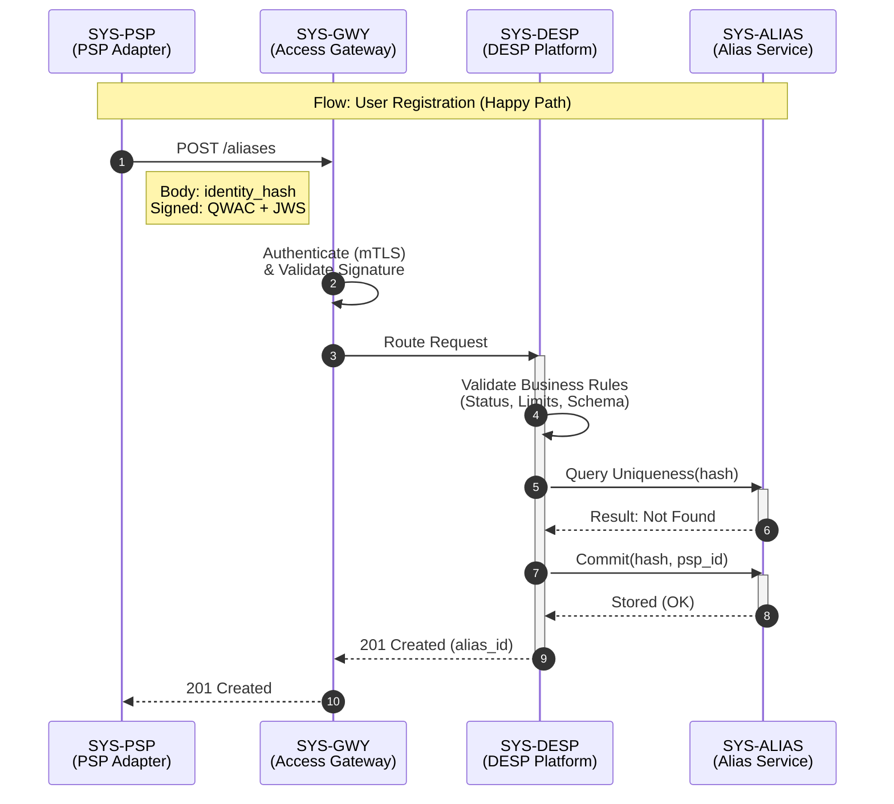
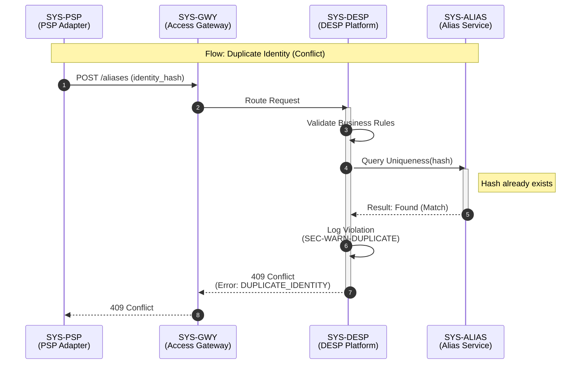
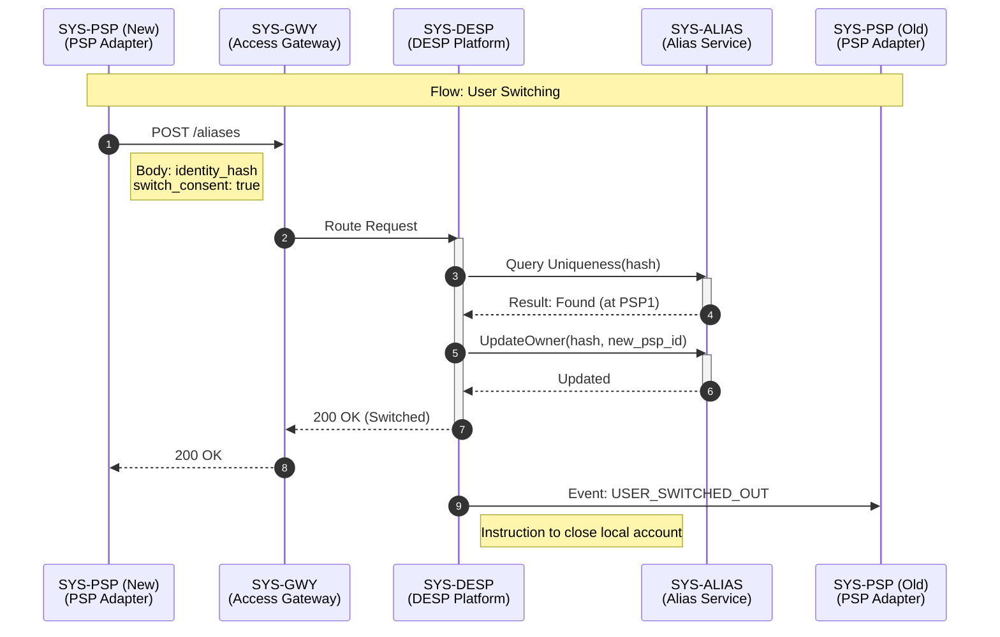

# User Onboarding — Interface Behaviour Specification

## 1. Identification
- **Global ID:** `SPEC-OB-INT`
- **Part of Set:** `SPEC-SET-ONB`
- **Traceability:**
    - **Upstream Spec:** `SPEC-OB-FUNC` (Implements `TR-OB-03` and `TR-OB-04`)
    - **Upstream Arch:** `@arch=SET-ARCH:0.1.0` (Implements `COMP-EUR-05` and `COMP-EUR-04`)

## 2. Purpose and Scope

This document defines the **component interactions** required to register a User Identity Hash with the Eurosystem.

It details the protocols, message flows, and security constraints for the interface between the **PSP's Adapter Service** and the **Digital Euro Service Platform (DESP)** via the Access Gateway.

## 3. Component Inventory (Actors)

The specific architectural components participating in these flows.

| ID | Component Name | Role | Responsibility | Trace |
| :--- | :--- | :--- | :--- | :--- |
| **SYS-PSP** | **PSP Adapter Service** | Client | The PSP's proprietary integration layer. Computes Hash, manages keys, and calls the Access Gateway. | `COMP-PSP-01` |
| **SYS-GWY** | **Access Gateway** | Interface | The Border Control. Terminates mTLS, validates QWACs, and routes sanitised requests to DESP. | `COMP-EUR-05` |
| **SYS-DESP** | **DESP Platform** | Orchestrator | The Central Platform. Enforces business logic, audit logging, and coordinates sub-services. | `COMP-EUR-04` |
| **SYS-ALIAS** | **Alias Service** | Registry | The System of Record. Pure storage engine for unique Identity Hashes. | `COMP-EUR-02` |

## 4. Interface Operation Catalog

The list of logical operations exposed by the Access Gateway (`SYS-GWY`) to support user onboarding.

| Op ID | Operation Name | Direction | Functional Trace |
| :--- | :--- | :--- | :--- |
| **OP-OB-01** | `RegisterUserHash` | `PSP` -> `EUR` | Executes `TR-OB-03` (KYC_CLEARED -> CHECKING_ALIAS) |
| **OP-OB-02** | `CheckUserStatus` | `PSP` -> `EUR` | Queries current status of a Hash (Idempotency check). |
| **OP-OB-03** | `SwitchUserPSP` | `PSP` -> `EUR` | Executes `TR-OB-06` (Switching Identity to new PSP). |

## 5. Interaction Flows

### 5.1 Flow: User Registration (Happy Path)

This flow covers the successful registration of a new User Identity Hash.

**Visualisation (Normative)**

**Step-by-Step Definition**

| Step ID | Sender | Receiver | Message / Action | Constraints / Rules | Trace |
| :--- | :--- | :--- | :--- | :--- | :--- |
| **STEP-REG-01** | `SYS-PSP` | `SYS-GWY` | `POST /aliases` | Body MUST contain `identity_hash`. Signed by PSP. | `REQ-OB-002` |
| **STEP-REG-02** | `SYS-GWY` | `SYS-GWY` | *Authenticate* | Validate PSP mTLS & JWS Signature. | `ARCH-SEC-02` |
| **STEP-REG-03** | `SYS-GWY` | `SYS-DESP` | *Route Request* | Pass authenticated context to DESP Platform. | `COMP-EUR-04` |
| **STEP-REG-04** | `SYS-DESP` | `SYS-DESP` | *Validate Business Rules* | Check PSP status, Rate Limits, and Schema. | `Rule ONB-02` |
| **STEP-REG-05** | `SYS-DESP` | `SYS-ALIAS` | *Query Uniqueness* | Internal call: "Does Hash X exist?" | `REQ-OB-FUNC-04` |
| **STEP-REG-06** | `SYS-ALIAS` | `SYS-DESP` | *Result: Not Found* | Confirm hash is new. | `REQ-OB-FUNC-06` |
| **STEP-REG-07** | `SYS-DESP` | `SYS-ALIAS` | *Commit* | Write Hash to Registry with `active_psp_id`. | `Rule ONB-01` |
| **STEP-REG-08** | `SYS-DESP` | `SYS-GWY` | `201 Created` | Return `alias_id` and `timestamp`. | `TR-OB-04` |
| **STEP-REG-09** | `SYS-GWY` | `SYS-PSP` | `201 Created` | Forward response to PSP. | `INT-OB-03` |

### 5.2 Flow: Duplicate Identity (Conflict)

This flow covers the scenario where the user already exists (Violation of Single Identity).

**Visualisation (Normative)**

**Step-by-Step Definition**

| Step ID | Sender | Receiver | Message / Action | Constraints / Rules | Trace |
| :--- | :--- | :--- | :--- | :--- | :--- |
| **STEP-DUP-01** | `SYS-DESP` | `SYS-ALIAS` | *Query Uniqueness* | (Triggered after Validation) | `REQ-OB-FUNC-04` |
| **STEP-DUP-02** | `SYS-ALIAS` | `SYS-DESP` | *Result: Found* | Hash already exists. | `REQ-OB-FUNC-05` |
| **STEP-DUP-03** | `SYS-DESP` | `SYS-DESP` | *Log Violation* | Record audit event `SEC-WARN-DUPLICATE`. | `AUD-OB-01` |
| **STEP-DUP-04** | `SYS-DESP` | `SYS-GWY` | `409 Conflict` | Error: `DUPLICATE_IDENTITY`. | `TR-OB-05` |
| **STEP-DUP-05** | `SYS-GWY` | `SYS-PSP` | `409 Conflict` | Forward error to PSP. | `INT-OB-03` |

### 5.3 Flow: User Switching (Portability)

This flow executes a Switch when the user consents to transfer their account (`Rule AM-011-004`).

**Visualisation (Normative)**

**Step-by-Step Definition**

| Step ID | Sender | Receiver | Message / Action | Constraints / Rules | Trace |
| :--- | :--- | :--- | :--- | :--- | :--- |
| **STEP-SW-01** | `SYS-PSP` (New) | `SYS-GWY` | `POST /aliases` | `switch_consent=true` | `REQ-OB-FUNC-09` |
| **STEP-SW-02** | `SYS-DESP` | `SYS-ALIAS` | *Verify Existence* | Hash must exist to switch. | `REQ-OB-FUNC-04` |
| **STEP-SW-03** | `SYS-DESP` | `SYS-ALIAS` | *Update Owner* | Change `active_psp_id` to New PSP. | `Rule ONB-04` |
| **STEP-SW-04** | `SYS-DESP` | `SYS-PSP` (New) | `200 OK` | Confirm Switch. | `TR-OB-06` |
| **STEP-SW-05** | `SYS-DESP` | `SYS-PSP` (Old) | *Event Notification* | Notify Old PSP to offboard. | `REQ-OB-FUNC-10` |

## 6. Technical Constraints

| ID | Constraint | Requirement Description | Trace |
| :--- | :--- | :--- | :--- |
| **INT-OB-01** | **Privacy Payload** | The payload MUST NOT contain any fields other than `identity_hash` and `psp_id`. Any other field triggers a `400 Bad Request`. | `Zone B` |
| **INT-OB-02** | **Signature Requirement** | Every request MUST carry a `JWS-Signature` header signed by the PSP's registered QWAC key. | `Rule ONB-02` |
| **INT-OB-03** | **Performance** | The `RegisterUserHash` operation MUST complete within 200ms (p99) to ensure smooth UX at the bank counter. | `NFR-PERF-02` |
| **INT-OB-04** | **Idempotency** | All state-changing operations (`POST`) MUST require an `Idempotency-Key` HTTP header (UUID v4) to allow safe retries. | `NFR-REL-01` |

## Appendix: How to Parse This Specification

**For Automation Engineers:**

1.  **Sequence Parsing:**
    * The `mermaid` blocks contain standard Mermaid syntax.
    * You can extract these blocks to generate live documentation images during the build process.
    * *Validation:* Ensure the `participant` names in Mermaid match the IDs in **Section 3**.

2.  **Contract Testing:**
    * Iterate through **Section 5 (Step-by-Step Definitions)**.
    * For every step where `Receiver` is `SYS-GWY` (incoming) or `SYS-DESP` (processing), assert that a corresponding API Endpoint exists in the `openapi.yaml`.
    * If `Constraints` mentions `JWS-Signature`, assert that the API Schema requires that header.

3.  **Simulation Configuration:**
    * Use the **Step IDs** (e.g., `STEP-REG-05`) to configure the Mock Server behavior.
    * *Example:* "If Test Case = `TC-DUP-01`, Mock `SYS-ALIAS` to return `Result: Found` at `STEP-DUP-02`."

