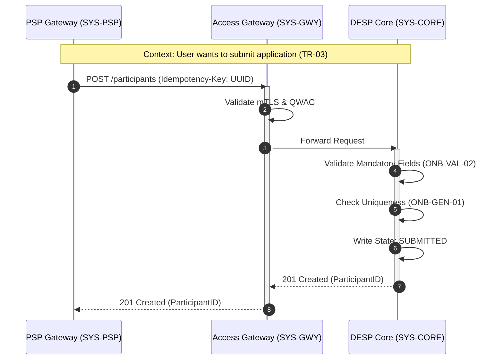
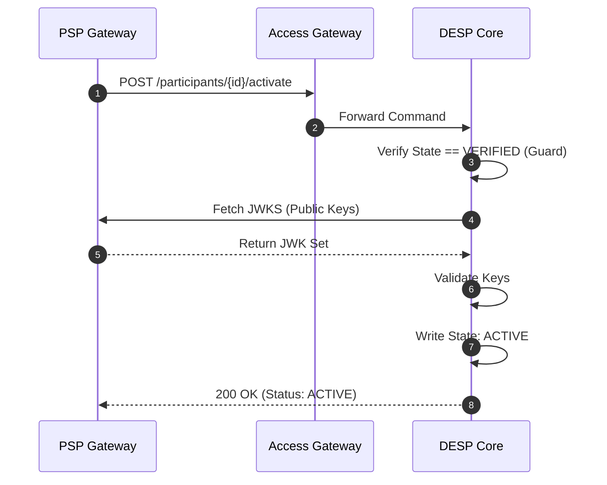

# Participant Onboarding — Interface Behaviour Specification

## Purpose

This document defines the **component interactions** required to execute the onboarding lifecycle.
It maps the abstract **State Transitions** (defined in the Functional Spec) to concrete **Interface Operations**.

## 1. Component Inventory (Actors)

The specific architectural components participating in these flows.

| ID | Component Name | Role | Responsibility | Trace |
| :--- | :--- | :--- | :--- | :--- |
| **SYS-PSP** | **PSP Gateway** | Client | Initiates requests; handles retries and idempotency keys. | `COMP-PSP-01` |
| **SYS-GWY** | **Access Gateway** | Interface | Termination point for TLS; validates mTLS and Idempotency. | `COMP-EUR-05` |
| **SYS-CORE** | **DESP Core** | Server | The System of Record. Executes the state change. | `COMP-EUR-04` |

## 2. Interface Operation Catalog

The list of logical operations exposed by the Access Gateway (`SYS-GWY`) to support onboarding.

| Op ID | Operation Name | Direction | Functional Trace |
| :--- | :--- | :--- | :--- |
| **OP-ONB-01** | `SubmitParticipant` | `PSP` $\to$ `EUR` | Executes `TR-03` (Draft $\to$ Submitted) |
| **OP-ONB-02** | `GetParticipantStatus` | `PSP` $\to$ `EUR` | Queries `DAT-PAR-005` (Lifecycle State) |
| **OP-ONB-03** | `ActivateParticipant` | `PSP` $\to$ `EUR` | Executes `TR-06` (Verified $\to$ Active) |

## 3. Interaction Flows

### 3.1 Flow: Submission (Happy Path)

This flow covers the transition from `DRAFT` to `SUBMITTED`.

**Visualisation (Normative)**

**Step-by-Step Definition**

| Step ID | Sender | Receiver | Message / Action | Constraints / Rules | Trace |
| :--- | :--- | :--- | :--- | :--- | :--- |
| **STEP-SUB-01** | `SYS-PSP` | `SYS-GWY` | `POST /participants` | Must include `Idempotency-Key` header. | `INT-TEC-01` |
| **STEP-SUB-02** | `SYS-GWY` | `SYS-GWY` | *Authenticate* | Must validate eIDAS QWAC certificate. | `SEC-AUTH-01` |
| **STEP-SUB-03** | `SYS-GWY` | `SYS-CORE` | *Forward* | Internal secure channel (mTLS). | `ARCH-SEC-02` |
| **STEP-SUB-04** | `SYS-CORE` | `SYS-CORE` | *Validate* | Execute Rule `ONB-VAL-02` (Completeness). | `TR-03` |
| **STEP-SUB-05** | `SYS-CORE` | `SYS-PSP` | `201 Created` | Body must contain `participant_id` and `state=SUBMITTED`. | `DAT-PAR-005` |

### 3.2 Flow: Activation (Key Exchange)

This flow covers the transition from `VERIFIED` to `ACTIVE`.

**Visualisation (Normative)**

**Step-by-Step Definition**

| Step ID | Sender | Receiver | Message / Action | Constraints / Rules | Trace |
| :--- | :--- | :--- | :--- | :--- | :--- |
| **STEP-ACT-01** | `SYS-PSP` | `SYS-GWY` | `POST .../activate` | Only permitted if current state is `VERIFIED`. | `TR-06` |
| **STEP-ACT-02** | `SYS-CORE` | `SYS-PSP` | `GET {jwks_url}` | System must verify the PSP's signing keys are reachable. | `ONB-VAL-03` |
| **STEP-ACT-03** | `SYS-CORE` | `SYS-CORE` | *State Transition* | Audit log must record `TR-06`. | `ONB-AUD-01` |

## 4. Technical Constraints

Cross-cutting technical rules for all interfaces.

| ID | Constraint | Requirement Description | Trace |
| :--- | :--- | :--- | :--- |
| **INT-TEC-01** | **Idempotency** | All state-changing verbs (`POST`, `PUT`, `PATCH`) MUST require an `Idempotency-Key` HTTP header (UUID v4). | `ONB-GEN-03` |
| **INT-TEC-02** | **Sync/Async** | Onboarding operations defined here are **Synchronous**. The system MUST respond within 30 seconds or return `504 Gateway Timeout`. | `NFR-PERF-01` |
| **INT-TEC-03** | **Error Format** | All 4xx/5xx responses MUST return a JSON `Problem Details` object (RFC 7807). | `RFC-7807` |

## Appendix: How to Parse This Specification

**For Automation Engineers:**

1.  **Sequence Parsing:**
    * The `mermaid` blocks contain standard Mermaid syntax.
    * You can extract these blocks to generate live documentation images during the build process.
    * *Validation:* Ensure the `participant` names in Mermaid match the IDs in **Section 1**.

2.  **Contract Testing:**
    * Iterate through **Section 3 (Step-by-Step Definitions)**.
    * For every step where `Receiver` is `SYS-CORE`, assert that a corresponding API Endpoint exists in the OpenAPI definition.
    * If `Constraints` mentions `Idempotency-Key`, assert that the API Schema requires that header.